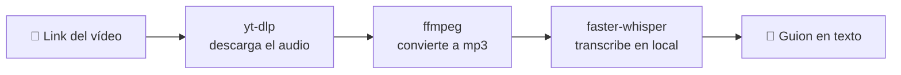

# 🎬 Video → Guion


[](https://video-transcriptor.streamlit.app)

Pega el link de un vídeo de **YouTube, TikTok o Instagram** y obtén su
transcripción completa — el guion — en unos segundos. Sin APIs de pago, sin
cuentas, sin límites de uso: todo corre con modelos **Whisper en local**.

**🔗 Pruébalo:** https://video-transcriptor.streamlit.app

## Por qué existe

Lo hice para dejar de perder tiempo transcribiendo a mano mis propios vídeos
(y los de referencia) cada vez que quería reutilizar o adaptar contenido.
Todas las herramientas "gratis" que encontré tenían límite de minutos o
pedían suscripción tarde o temprano, así que monté el pipeline completo con
piezas open source que corren sin coste ni claves de API.

## Cómo funciona



1. **yt-dlp** descarga el audio del vídeo a partir del link.
2. **ffmpeg** lo convierte a mp3.
3. **faster-whisper** (Whisper corriendo en local, sin API) lo transcribe a texto.
4. **Streamlit** muestra el resultado con opción de descargar el `.txt`.

## Stack

| Pieza | Uso |
|---|---|
| [Streamlit](https://streamlit.io) | interfaz web |
| [yt-dlp](https://github.com/yt-dlp/yt-dlp) | descarga de vídeo/audio |
| [faster-whisper](https://github.com/SYSTRAN/faster-whisper) | transcripción (Whisper + CTranslate2) |
| [ffmpeg](https://ffmpeg.org) | procesado de audio |

## Uso rápido en local

```bash
git clone https://github.com/Emmanuel-Edogiawerie/video-transcriptor.git
cd video-transcriptor

python -m venv .venv
.venv\Scripts\activate        # Windows — usa "source .venv/bin/activate" en macOS/Linux
pip install -r requirements.txt

# necesitas ffmpeg instalado y en el PATH
# Windows: winget install ffmpeg   |   macOS: brew install ffmpeg   |   Linux: apt install ffmpeg

streamlit run app.py
```

Se abre en `http://localhost:8501`.

## Despliegue gratis (Streamlit Community Cloud)

> Hugging Face Spaces dejó de ser gratis para apps con backend Python
> (Gradio/Docker): ahora exige suscripción PRO en el tier gratuito. Por eso
> este proyecto usa **Streamlit Community Cloud**, que sigue siendo 100%
> gratis para repos públicos de GitHub, sin tarjeta.

1. Entra en [share.streamlit.io](https://share.streamlit.io) e inicia sesión con GitHub.
2. **Create app** → **Deploy a public app from GitHub**.
3. Repo: `Emmanuel-Edogiawerie/video-transcriptor` · Branch: `master` · Main file: `app.py`.
4. **Deploy**. Streamlit Cloud instala `requirements.txt` (paquetes Python) y
   `packages.txt` (paquetes de sistema, aquí `ffmpeg`) automáticamente.
5. Cada `git push` a `master` redespliega la app sola.

## Estructura del proyecto

```
video-transcriptor/
├── app.py             # app Streamlit (UI + orquestación del pipeline)
├── requirements.txt   # dependencias Python
├── packages.txt       # dependencias de sistema (ffmpeg) para Streamlit Cloud
└── README.md
```

## Limitaciones conocidas

- En el tier gratuito (CPU, sin GPU) los modelos `tiny`/`base` son rápidos;
  `small` es más preciso pero tarda más en vídeos largos.
- Instagram a veces bloquea descargas sin sesión iniciada — puede fallar en
  contenido privado o restringido.
- Pensado para sacar guiones propios o de referencia sobre vídeo **público**,
  no para scraping masivo. Respeta los términos de servicio de cada
  plataforma.

## Roadmap

- [ ] Timestamps por segmento (además del texto plano)
- [ ] Detección/selección manual de idioma
- [ ] Exportar directamente a `.srt`

## Licencia

[MIT](LICENSE) — úsalo, modifícalo, compártelo.

---

Hecho por [Emmanuel Osa](https://github.com/Emmanuel-Edogiawerie).
